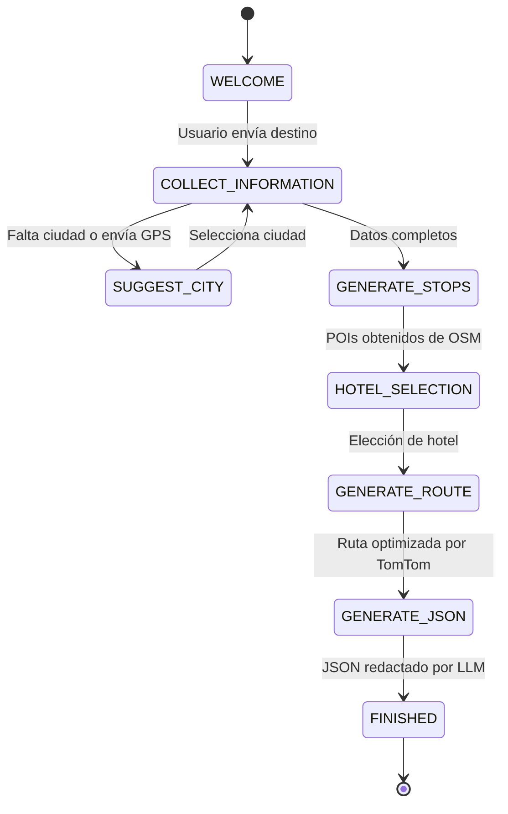

# VIBETOURS - Manual y Arquitectura del Sistema de IA 🤖🗺️

Este documento ofrece una explicación exhaustiva sobre el funcionamiento de la **Inteligencia Artificial** en **VIBETOURS**, su arquitectura técnica, el motor conversacional por máquina de estados, el sistema anti-alucinación geoespacial, así como sus **capacidades**, **limitaciones** y **límites de cuota**.

---

## 🤖 1. Filosofía del Sistema de IA

En VIBETOURS, la Inteligencia Artificial **no es un chatbot genérico de texto libre**. Es un **motor estructurado de planificación y curación turística** diseñado para transformar los deseos de un viajero en un itinerario real, geolocalizado, narrable y optimizado.

### Principios Fundamentales:
1. **Anclaje Geoespacial Real**: La IA no inventa lugares. Trabaja sobre una lista de Puntos de Interés (POIs) físicos extraídos de OpenStreetMap y validados con Wikipedia.
2. **Guías de Voz Inmersivas**: Cada descripción generada está redactada como un guion de audio (120 a 180 palabras) para ser leído en vivo mediante Sintesis de Texto a Voz (TTS).
3. **Personalización Basada en Perfil**: Adapta el tono, las recomendaciones y el ritmo según el perfil del turista (si viaja solo, en pareja, con niños, ritmo acelerado o relajado).
4. **Resistencia a Alucinaciones**: Si el usuario pide cosas imposibles o fuera de contexto, el sistema activa filtros estrictos de irrelevancia.

---

## 🏗️ 2. Arquitectura Técnica de la IA

El ecosistema de IA opera mediante una combinación de microservicios backend y servicios en la nube:

```
                          [Cliente Flutter / Voz / Prompt]
                                          │
                                          ▼
                         [Express API (/api/ai & /api/chat)]
                                          │
 ┌────────────────────────────────────────┼────────────────────────────────────────┐
 │                                        │                                        │
 ▼                                        ▼                                        ▼
[extractLocation]                 [chatSession.js]                        [planWithOpenAI]
Analiza la intención libre        Máquina de Estados                       Genera el JSON final
y extrae variables de viaje       Conversacionales                         con Guías de Voz
 (GPT-4o-mini / JSON format)      (Paso a Paso)                            (Prompt Estricto)
 │                                        │                                        │
 └────────────────────────────────────────┼────────────────────────────────────────┘
                                          │
                                          ▼
                       [Servicios Geoespaciales y Datos]
                 OpenStreetMap (Overpass) ➔ Wikipedia ➔ TomTom
```

### Componentes Clave:
- **`backend/src/services/openai.js`**: Módulo central que encapsula las llamadas a la API de OpenAI usando `gpt-4o-mini` con formato de respuesta JSON forzado (`response_format: { type: "json_object" }`).
- **`backend/src/routes/chat.js`**: Controlador de la máquina de estados conversacional que interactúa con el usuario paso a paso.
- **`backend/src/routes/ai.js`**: Enrutador para la generación asíncrona/sincrónica de tours y recomendaciones.
- **`supabase/functions/ai-planner`**: Edge Function en Deno para la ejecución serverless distribuida.
- **Soporte Local (Ollama)**: Capacidad de conmutar a modelos locales (Mistral / Llama 3) en entornos sin conexión a OpenAI.

---

## 🔄 3. Máquina de Estados Conversacional (`chat.js`)

Cuando el usuario utiliza el asistente conversacional (`AiBuilderScreen`), el backend gestiona la sesión mediante una **Máquina de Estados Finita**:



### Descripción de los Estados:
- **`WELCOME`**: Presentación del asistente y solicitud inicial del destino.
- **`COLLECT_INFORMATION`**: Utiliza `extractChatInformation` para identificar dinámicamente los campos requeridos: `city`, `budget`, `travelers`, `duration`, `pace`, `schedule`, `transportation`, e `interests`. Pregunta un solo dato faltante a la vez para no abrumar al usuario.
- **`SUGGEST_CITY`**: Si el usuario envía su posición GPS o un nombre ambiguo, geocodifica la posición y sugiere 3 ciudades cercanas.
- **`GENERATE_STOPS`**: Consulta la base de datos libre de OpenStreetMap (Overpass API) para traer atracciones icónicas reales en un radio de hasta 10 km.
- **`HOTEL_SELECTION`**: Ofrece buscar hoteles reales en la zona adaptados al presupuesto del usuario para fijarlo como punto de encuentro.
- **`GENERATE_ROUTE`**: Envía los Puntos de Interés a TomTom API para resolver el orden geográfico óptimo y reducir tiempos de traslado.
- **`GENERATE_JSON`**: Invoca el LLM final (`planWithOpenAI`) para redactar las descripciones, actividades, historias y consejos.
- **`FINISHED`**: Presenta la tarjeta final del tour en el chat lista para ser recorrida en vivo.

---

## 🛡️ 4. Estrategia Anti-Alucinación (Anclaje Geoespacial Real)

Las alucinaciones son el principal defecto de las IAs generativas de viajes. VIBETOURS implementa un **pipeline de anclaje geográfico de 5 niveles**:

1. **Geocodificación Real (Nominatim / Photon)**: Convierte el texto libre del usuario en coordenadas $(Lat, Lon)$ reales. Si la ciudad tiene homónimos (ej: *Cartagena de Indias* vs. *Cartagena de España*), el sistema utiliza la geolocalización actual del usuario como contexto determinista.
2. **Extracción de Puntos Reales (Overpass API)**: La IA no elige de su memoria de entrenamiento; consulta la base de datos de OpenStreetMap para extraer nodos físicos existentes clasificados como `tourism=attraction`, `historic=monument`, `amenity=arts_centre`, `leisure=park`, etc.
3. **Inyección de Historia Verificada (Wikipedia API)**: Antes de llamar al LLM, el backend consulta Wikipedia con los nombres de las paradas extraídas y añade resúmenes históricos reales al prompt.
4. **Optimización Espacial (TomTom API)**: Garantiza que las paradas tengan una secuencia geográfica lógica (TSP - Traveling Salesperson Problem).
5. **Fallback Supervisado (`suggestFallbackPlacesWithOpenAI`)**: Solo en destinos remotos donde OpenStreetMap tenga pocos datos, se activa una función supervisada que exige al modelo retornar únicamente 3 lugares que *existan físicamente*.

---

## 📜 5. Prompts y Formatos Narrativos Estrictos

El prompt del generador (`planWithOpenAI`) impone reglas estrictas de narración y formato:

### Reglas Narrativas de Guía de Voz:
- **Tono Inmersivo**: Escribe en primera persona como un guía local apasionado hablando al oído del viajero.
- **Extensión Estricta**: Cada parada requiere entre **120 y 180 palabras**. Prohibidas descripciones resumidas o genéricas.
- **Cero Frases Cliché**: Se prohíbe explícitamente usar frases vacías como:
  - ❌ *"En esta parada verás..."*
  - ❌ *"Ahora nos dirigimos a..."*
  - ❌ *"Aquí puedes observar..."*
  - ❌ *"Continuamos nuestro tour hacia..."*
- **Estructura Interna de la Parada**:
  - Historia fascinante y contexto cultural.
  - Detalles arquitectónicos o naturales visibles.
  - Qué hacer o qué probar allí.
  - 2 a 5 datos curiosos históricos verificados.
  - Recomendaciones prácticas sobre qué llevar.
  - Método de transporte sugerido si la parada es lejana (ej: *"Tomar una lancha desde el muelle principal"*).

---

## ✅ 6. Lo que la IA PUEDE Hacer (Capacidades Confirmadas)

| Capacidad | Descripción |
| :--- | :--- |
| **Procesamiento de Lenguaje Natural** | Interpreta mensajes libres dictados por voz o escritos en cualquier idioma. |
| **Extracción Semántica de Viaje** | Identifica ciudad, duración (1 a 120 horas), presupuesto, ritmo e intereses. |
| **Sugerencia de Destinos Inteligente** | Si el usuario no sabe a dónde ir, sugiere 3 ciudades adaptadas a sus gustos. |
| **Diseño de Itinerarios Multidía** | Distribuye las paradas en días equilibrados (Día 1, Día 2, etc.) según la duración. |
| **Guías de Voz Inmersivas** | Genera guiones de audio de alta calidad listos para reproducción por voz (TTS). |
| **Instrucciones de Transporte Especial** | Detalla el uso de lanchas, buses intermunicipales o caminatas cuando el sitio es distante. |
| **Integración de Hotel de Encuentro** | Establece el hotel seleccionado como punto de partida y llegada del recorrido. |
| **Detección de Irrelevancia (`is_unrelated`)**| Si el usuario escribe caracteres aleatorios o temas ajenos, responde amablemente reorientando hacia viajes. |
| **Estimación de Presupuestos** | Calcula costos promedios estimados en USD para niveles bajo, medio y alto. |

---

## ❌ 7. Lo que la IA NO PUEDE Hacer (Restricciones y Prohibiciones)

> [!WARNING]
> Es crucial conocer los límites del motor de IA para evitar falsas expectativas de integración.

1. **NO realiza Reservas ni Pagos en Vivo**: La IA diseña el itinerario y sugiere hoteles u operadoras, pero **no** tiene acceso a pasarelas de pago ni APIs de reserva en tiempo real (ej: Booking, Amadeus o Skyscanner).
2. **NO conoce Eventos Imprevistos en Tiempo Real fuera de APIs**: No puede saber si un museo cerró de emergencia hoy por huelga o restauración (aunque sí consulta el pronóstico del clima en tiempo real con Open-Meteo).
3. **NO inventa Atracciones Falsas**: El prompt prohíbe terminantemente inventar lugares no existentes en la lista geoespacial entregada por el backend.
4. **NO es un Chatbot de Propósito General**: No responderá preguntas sobre programación, matemáticas, medicina, deportes o política. Su prompt de sistema restringe su comportamiento a la planificación de viajes.
5. **NO procesa más de 30 Paradas Simultáneas**: Por limitaciones de ventana de contexto del LLM y para garantizar respuesta rápida, los lugares procesados por llamada se limitan a máximo 30 POIs.

---

## 📊 8. Límites de Uso, Cuotas y Seguridad

To garantizar la estabilidad financiera y técnica del proyecto:

### 1. Control de Uso en Modo Invitado (`guestAiRemainingProvider`)
- Los usuarios no autenticados tienen un límite estricto de **2 generaciones de tours con IA**.
- El estado es gestionado por Riverpod en `guestAiRemainingProvider`.
- Al agotar las 2 generaciones, la interfaz solicita al usuario registrarse o iniciar sesión gratuitamente para continuar generando tours sin límite.

### 2. Timeouts y Reintentos
- La llamada a OpenAI tiene un tiempo límite configurable (`OPENAI_TIMEOUT_MS`, por defecto 90 segundos).
- Si la llamada falla o el JSON retorna corrupto, el backend ejecuta automáticamente un **reintento transparente (Attempt 2)** antes de reportar error al usuario.

### 3. Fallback Graceful sin API Key
- Si `OPENAI_API_KEY` no está presente en el servidor backend, el sistema de IA no colapsa la app. En su lugar, reporta un mensaje claro o redirige al catálogo de tours precargados en modo local.
