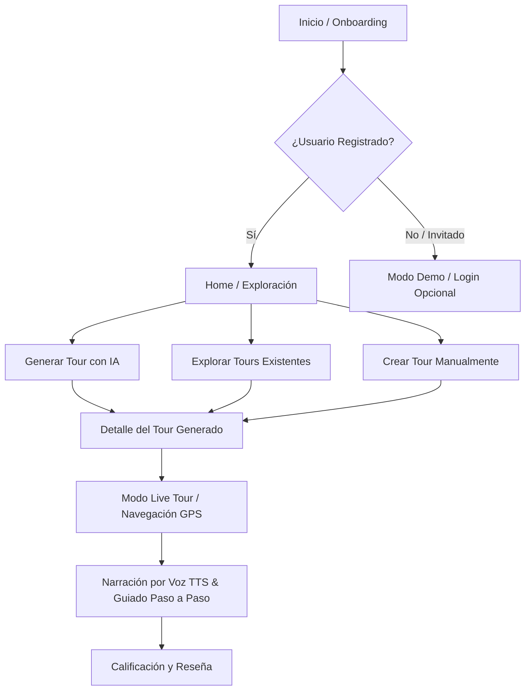

# VIBETOURS - Documentación General de la Aplicación 📱🗺️

Bienvenido a la documentación oficial del sistema **VIBETOURS**. Este documento ofrece un panorama detallado sobre la arquitectura de la aplicación, el stack tecnológico utilizado, el funcionamiento interno del backend y un desglose completo de **todas las funcionalidades disponibles** en la plataforma.

---

## 📌 1. Visión General y Propuesta de Valor

**VIBETOURS** es una plataforma móvil y web de turismo inteligente que transforma la manera en que los viajeros exploran ciudades. Combina inteligencia artificial generativa, datos geográficos libres (OpenStreetMap), narración por voz en tiempo real y mapas vectoriales interactivos para ofrecer guías turísticas personalizadas e inmersivas.

### Problemas que resuelve:
- **Tours rígidos y costosos**: Los guías tradicionales imponen itinerarios fijos. VIBETOURS crea itinerarios a la medida del usuario (ritmo, presupuesto, intereses, viaje con niños o en pareja).
- **Alucinaciones en itinerarios de IA**: A diferencia de herramientas de chat genéricas que inventan sitios falsos, VIBETOURS ancla la IA a coordenadas físicas reales y lugares verificados en OpenStreetMap y Wikipedia.
- **Experiencia manos libres**: Durante el recorrido, la app actúa como un guía de voz humano en vivo utilizando sintesis de texto a voz (TTS) mientras el GPS sigue la posición del usuario.

---

## 🧠 2. Cómo Funciona la Aplicación

El flujo de usuario en VIBETOURS sigue un trayecto continuo y adaptativo:



1. **Bienvenida y Perfilamiento**: El usuario define sus preferencias turísticas (ritmo de caminata, tipo de viajeros, presupuesto, intereses).
2. **Exploración o Generación**: El usuario puede explorar 50 tours precargados de ciudades colombianas e internacionales, o pedirle a la IA que cree un tour personalizado en cualquier ciudad del mundo.
3. **Previsualización de Ruta**: Se presenta el itinerario con mapas interactivos (MapLibre GL), descripciones ricas, historia, presupuesto estimado y paradas.
4. **Navegación en Vivo (Live Tour)**: Durante el recorrido, la app monitorea la posición GPS, reproduce narraciones de voz automáticas al aproximarse a cada parada, permite interactuar por dictado de voz y registra el progreso del viaje.

---

## 🛠️ 3. Stack Tecnológico

| Capa | Tecnologías / Librerías | Descripción |
| :--- | :--- | :--- |
| **Frontend Mobile** | Flutter 3.x, Dart | Desarrollo multiplataforma iOS y Android de alto rendimiento. |
| **Gestión de Estado** | Riverpod (`flutter_riverpod`) | Arquitectura reactiva, modular e inmutable. |
| **Navegación** | GoRouter (`go_router`) | Rutas declarativas, guards de autenticación y transiciones visuales. |
| **Mapas & GPS** | MapLibre GL (`maplibre_gl`), Geolocator | Renderizado de mapas vectoriales y seguimiento de ubicación GPS. |
| **Voz e Interacción** | `flutter_tts`, `speech_to_text` | Narración por voz del itinerario y dictado por micrófono. |
| **Backend REST API** | Node.js, Express.js, Zod | Servidor de procesamiento lógico, geocodificación e IA. |
| **Modelos de IA** | OpenAI API (`gpt-4o-mini`), Ollama | Extracción de intención, generación de narraciones y fallback POIs. |
| **Geodatos libres** | OpenStreetMap, Nominatim, Photon, Overpass API | Geocodificación, autocompletado y consulta geoespacial de POIs y hoteles. |
| **Servicios Adicionales**| Wikipedia API, TomTom API, Open-Meteo, Unsplash, OpenVerse | Contexto histórico, optimización de rutas, clima en vivo e imágenes. |
| **BaaS & Persistencia**| Supabase (Auth, Postgres, Storage, RLS), Firebase | Base de datos relacional, login OAuth, almacenamiento y telemetría. |

---

## 📋 4. Desglose Completo de Funcionalidades Disponibles

La aplicación cuenta con 10 módulos principales, cada uno diseñado para cumplir un rol específico dentro de la experiencia turística:

### 1️⃣ Onboarding y Perfil Turístico Personalizable (`features/onboarding`, `features/profile`)
- **Configuración de Preferencias de Viajero (`TouristProfileV2`)**:
  - *Ritmo de Viaje*: Relajado, Equilibrado o Acelerado.
  - *Compañeros de Viaje*: Solo, En Pareja, En Familia o Con Amigos.
  - *Presupuesto Preferido*: Económico, Moderado o De Lujo.
  - *Presencia de Menores*: Ajusta automáticamente las sugerencias de paradas para ser pet-friendly / kid-friendly.
  - *Categorías de Interés*: Historia, Gastronomía, Arte, Naturaleza, Arquitectura, Compras, Fotografía, Vida Nocturna.
- **Edición Dinámica de Perfil**: Posibilidad de modificar las preferencias en cualquier momento desde el perfil de usuario.

### 2️⃣ Autenticación, Control de Acceso y Modo Demo (`features/auth`, `state/app_state.dart`)
- **Inicio de Sesión y Registro**: Vía correo electrónico/contraseña con validación de Supabase Auth.
- **Autenticación Social (Google OAuth)**: Login fluido mediante Google Sign-In nativo.
- **Modo Invitado / Demo (Offline Resilient)**:
  - Permite probar la app sin crear cuenta.
  - Otorga acceso completo al catálogo interno de **50 tours precargados**.
  - Límite de 2 generaciones con IA en modo invitado (`guestAiRemainingProvider`), requiriendo inicio de sesión para generaciones ilimitadas.

### 3️⃣ Pantalla Principal (Home) y Exploración Urbana (`features/home`)
- **Geolocalización en Tiempo Real**: Detecta la ciudad del usuario y muestra información contextualizada.
- **Tarjeta de Clima en Vivo**: Muestra la temperatura actual, humedad, sensación térmica y estado meteorológico utilizando Open-Meteo API.
- **Descubrimiento de Lugares Cercanos**: Consulta Puntos de Interés (POIs) reales en un radio dinámico (4.5 km a 9 km) mediante la API de Overpass.
- **Eventos Locales Cercanos**: Sugerencias de eventos culturales, gastronómicos y ferias en las proximidades del usuario.
- **Carrusel de Tours Destacados**: Tours populares categorizados por ciudades nacionales e internacionales.

### 4️⃣ Planificador de Tours por IA (Vibe Planner AI / TourSync AI) (`features/ai`)
- **Modo Directo (Prompt Libre)**: Entrada de texto o dictado por voz donde el usuario expresa lo que quiere hacer (ej: *"Un recorrido de 3 horas por los sitios históricos de Cartagena"*).
- **Asistente Conversacional Guiado (`AiBuilderScreen`)**:
  - Interfaz tipo chat con máquina de estados finita (`chat.js`).
  - Recolección paso a paso de datos faltantes (ciudad, presupuesto, transporte, hotel).
  - Sugerencia interactiva de hoteles reales como punto de encuentro.
- **Generación Asíncrona / Sincrónic con Polling**: Procesa las solicitudes en segundo plano con indicadores de progreso visual (Geocodificando ➔ Consultando POIs ➔ Optimizando Ruta ➔ Redactando Guías).

### 5️⃣ Creador Manual de Tours (`features/creator`)
- **Diseñado para Creadores de Contenido y Guías Locales**:
  - Definición de título, categoría principal, subcategorías y descripción general.
  - Selección e subida de imagen de portada (almacenada en Supabase Storage).
  - Adición dinámica de paradas en el mapa interactivo con búsqueda geocodificada.
  - Ordenamiento drag-and-drop de paradas.
  - Envío del tour al sistema de moderación en estado `pending`.

### 6️⃣ Búsqueda Global, Catalogo y Filtros Avanzados (`features/tours`)
- **Buscador Universal de Lugares**: Integrado con el motor Photon de OpenStreetMap para encontrar cualquier destino mundial.
- **Filtros por Parámetros**:
  - Por País o Ciudad.
  - Por Tipo de Tour (Cultural, Gastronómico, Aventura, Naturaleza, Histórico).
  - Por Duración (Tours de media jornada, día completo o múltiples días).

### 7️⃣ Detalle y Visualización de Tour (`features/tours/tour_detail_screen.dart`)
- **Ficha Técnica Completa**:
  - Nombre, duracion estimada, distancia total, nivel de dificultad y mejor época del año.
  - Punto de encuentro con mapa estático/interactivo y dirección física.
  - Presupuesto estimado desglosado (Bajo, Medio, Alto en USD).
  - Lista de lo que incluye, lo que no incluye, normas y qué llevar.
- **Desglose Itinerante Día por Día / Parada por Parada**:
  - Guías narrativas de voz escritas con tono apasionado local.
  - Actividades específicas recomendadas en cada sitio.
  - 2 a 5 datos curiosos históricos o culturales verificados.
  - Consejos de transporte especial (ej: *"Tomar lancha desde el muelle principal"*).
- **Galería de Imágenes Curadas**: Fotografías en alta resolución traídas mediante Unsplash u OpenVerse.

### 8️⃣ Navegación Guiada en Vivo (Live Tour Mode) (`features/tour_live`)
- **Navegación GPS Activa**: Visualización de la posición del usuario sobre el mapa vectorial de MapLibre GL en tiempo real.
- **Acompañante por Voz (Text-to-Speech)**: Reproduce automáticamente la narrativa de la parada cuando el usuario ingresa al radio de proximidad.
- **Interacción por Dictado de Voz (Speech-to-Text)**: Permite controlar la app o dictar notas mediante comandos hablados.
- **Control de Progreso**: Marcado manual o automático de paradas completadas, temporizador de recorrido y distancia restante.
- **Diálogo de Calificación y Reseñas (`TourRatingDialog`)**: Al finalizar el recorrido, permite al usuario valorar la experiencia con estrellas (1 a 5) y dejar comentarios.

### 9️⃣ Panel de Administración Único (`/admin`) (`features/admin`)
- **Protección por `public.admin_account`**: Acceso restringido exclusivamente a la cuenta administradora configurada en la base de datos.
- **Moderación de Contenido Generado por Usuarios (UGC)**:
  - Lista de tours pendientes de revisión (`moderation_status = 'pending'`).
  - Inspección previa del itinerario y contenido antes de su publicación.
  - Botones de **Aprobar** (`approved`) o **Rechazar** (`rejected`).
- **Métricas Básicas del Sistema**: Monitoreo de tours publicados y creados por la comunidad.

### 🔟 Centro de Ayuda, PQRS y Secciones Legales (`features/support`, `features/legal`)
- **Módulo PQRS (Peticiones, Quejas, Reclamos y Sugerencias)**: Formulario directo para el envío de solicitudes de soporte técnico o reportes de usuario.
- **Centro de Ayuda y Preguntas Frecuentes (FAQ)**: Guía paso a paso sobre cómo usar el planificador de IA, crear tours y usar la navegación offline.
- **Términos de Servicio y Políticas de Privacidad (`/legal/:kind`)**: Documentación legal requerida para tiendas de aplicaciones (App Store / Google Play).

---

## 🏗️ 5. Arquitectura del Backend REST (Node.js/Express)

El backend de VIBETOURS actua como la orquesta central que conecta las peticiones del cliente móvil con los servicios de geodatos e IA:

```
[Flutter App] ─── HTTP REST ───> [Express Server (server.js)]
                                      │
       ┌──────────────────────────────┼──────────────────────────────┐
       ▼                              ▼                              ▼
[/api/ai]                      [/api/chat]                   [/api/discovery]
• /tours/generate              • /start                      • /search (Photon)
• /tours/confirm               • /message                    • /nearby (Overpass)
• /tours/recommend             (State Machine)               • /weather (Open-Meteo)
       │                              │                              │
       └──────────────────────────────┼──────────────────────────────┘
                                      ▼
                     [Services Layer (src/services/)]
  • openai.js    -> LLM Planner & Semantics (GPT-4o-mini)
  • osm.js       -> Nominatim, Photon, Overpass POIs & Hotels
  • tomtom.js    -> Route Optimization & TSP Solver
  • wikipedia.js -> Historical Data Enrichment
  • imageSearch.js -> Unsplash / OpenVerse API
  • supabase.js  -> Service Role Database Access
```

### Rutas REST Principales:
- `POST /api/ai/tours/generate`: Inicia la generación asíncrona o sincrónica de un tour.
- `GET /api/ai/tours/status/:jobId`: Consulta el progreso del trabajo de IA.
- `POST /api/chat/start`: Crea una nueva sesión conversacional para el asistente interactivo.
- `POST /api/chat/message`: Envía un mensaje a la máquina de estados del chat.
- `GET /api/discovery/nearby`: Obtiene atracciones cercanas según latitud y longitud.
- `GET /api/discovery/weather`: Retorna el clima en vivo para una ubicación.
- `GET /api/tours`: Lista todos los tours aprobados y publicados.
- `GET /api/tours/pending`: Lista tours pendientes para el panel de administración.
- `PATCH /api/tours/:id/moderate`: Aprueba o rechaza un tour en moderación.

---

## 🗄️ 6. Estructura de la Base de Datos (Supabase PostgreSQL)

La base de datos relacional en Supabase almacena la información estructurada de usuarios, tours, paradas y moderación.

```mermaid
erdiagram
    profiles ||--o{ tours : "crea"
    tours ||--|{ tour_stops : "contiene"
    profiles ||--o{ tour_reviews : "escribe"
    tours ||--o{ tour_reviews : "recibe"
    profiles ||--o{ user_favorites : "guarda"
    tours ||--o{ user_favorites : "es favorito de"
    admin_account ||--|| profiles : "autoriza admin"

    tours {
        uuid id PK
        string title
        string city
        string country
        string type
        text description
        string cover_url
        boolean is_published
        string moderation_status
        uuid created_by FK
        float rating
        timestamp created_at
    }

    tour_stops {
        uuid id PK
        uuid tour_id FK
        integer stop_order
        string name
        text description
        float latitude
        float longitude
        jsonb activities
        jsonb fun_facts
        jsonb tips
    }

    admin_account {
        boolean id PK
        uuid user_id FK
        string email
    }
```

### Seguridad y RLS (Row Level Security):
- **Tours Públicos**: Lectura pública para cualquier usuario autenticado o invitado (`is_published = true`).
- **Creación de Tours**: Los usuarios autenticados pueden insertar tours con `moderation_status = 'pending'`.
- **Modificación**: Solo el creador del tour o un administrador pueden editar sus propios tours.
- **Acceso Administrativo**: Protegido mediante políticas RLS que verifican la pertenencia en `public.admin_account`.

---

## 📴 7. Resiliencia y Modo Demo / Offline

Para garantizar que la aplicación jamás falle por falta de servidor o señal de internet durante un viaje:
1. **Detección Automática**: Si las llamadas al backend o Supabase fallan, el estado global conmuta a `isDemoMode = true`.
2. **Catálogo Local**: La app dispone de 50 tours estructurados precargados en JSON local dentro de la carpeta `assets/`.
3. **Simulador de Recorrido**: El usuario puede activar el modo Live Tour en cualquier tour de demostración y probar la voz TTS y el mapa sin gastar datos.
