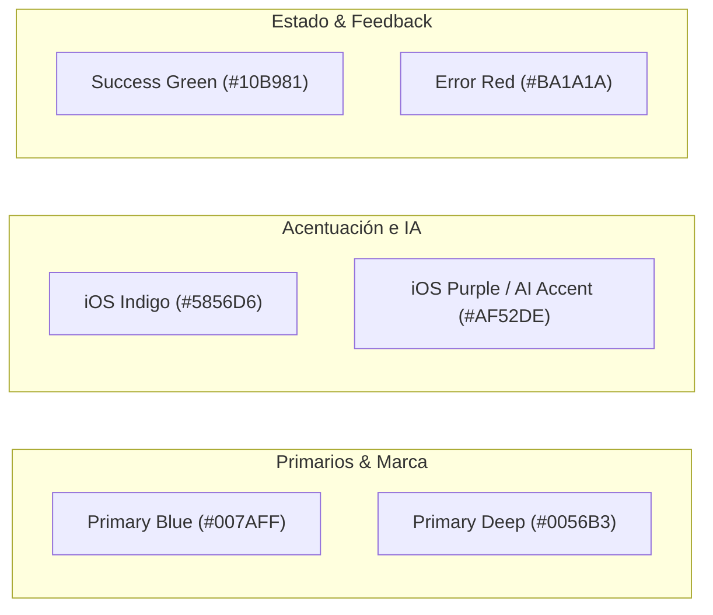

# VIBETOURS - Sistema y Estilo de Diseño (Design System) 🎨✨

Este documento define la guía de diseño visual, la paleta de colores, la tipografía, los componentes de interfaz y el estilo artístico del proyecto **VIBETOURS**.

---

## 💎 1. Filosofía de Diseño y Estilo Artístico

VIBETOURS adopta una estética **Neomórfica y Glassmorphic de Lujo** inspirada en las líneas de diseño modernas de **iOS / Apple**, combinando sobriedad, elegancia y dinamismo.

### Principios Fundamentales de Diseño:
- **Efecto Cristal Traslúcido (Glassmorphism)**: Paneles flotantes con desenfoque de fondo (*backdrop blur*), reflejos luminosos en los bordes y sombras profundas pero sutiles.
- **Dinamismo e Interacción**: Uso constante de micro-animaciones suaves (`flutter_animate`), animaciones de vectores (`Lottie`) y transiciones de pantalla con físicas fluidas.
- **Claridad Visual y Jerarquía**: Tipografía grande y audaz (*Extra Bold*) contrastada con superficies limpias y bordes muy suaves.
- **Adaptabilidad a la Luz**: Experiencia nativa e inmersiva tanto en **Modo Claro (Light)** como en **Modo Oscuro (Dark)**.

---

## 🎨 2. Paleta de Colores (`VibeColors` & `AppTheme`)

La paleta de colores de VIBETOURS utiliza tonos tailoring de alta fidelidad, evitando colores planos genéricos:



### Tabla de Especificaciones de Color:

| Nombre del Color | Código Hex | Uso y Propósito |
| :--- | :--- | :--- |
| **Primary Blue** | `#007AFF` | Color de marca principal, botones de acción (CTA), estados activos e indicadores de navegación. |
| **Primary Deep** | `#0056B3` | Tono azul oscuro para gradientes de profundidad y sombras de botones. |
| **iOS Indigo** | `#5856D6` | Color secundario para badges, iconos de categoría e itinerarios. |
| **iOS Purple / AI Accent** | `#AF52DE` | Color distintivo asignado a las funciones de **Inteligencia Artificial** (Planificador, Chatbot, Tarjetas de IA). |
| **Success Green** | `#10B981` | Notificaciones de éxito, paradas completadas y estados aprobados. |
| **Error Red** | `#BA1A1A` | Alertas, errores de validación y estado rechazado. |

---

## 🌗 3. Modos de Tema: Claro vs. Oscuro

La aplicación adapta dinámicamente sus superficies y niveles de transparencia según el tema activo:

### ☀️ Modo Claro (Light Mode)
- **Fondo de Pantalla (`lightBackground`)**: `#F2F2F7` *(iOS Grouped Background Light)*.
- **Superficie de Tarjetas (`surface`)**: `#FFFFFF` *(Blanco Puro)*.
- **Texto Principal (`onSurface`)**: `#000000` *(Negro con alto contraste)*.
- **Panel de Cristal (`glass`)**: `rgba(255, 255, 255, 0.85)` con desenfoque de fondo.
- **Borde Luminoso (`border`)**: `#C6C6C8` *(Gris sutil estilo separador iOS)*.

### 🌙 Modo Oscuro (Dark Mode)
- **Fondo de Pantalla (`darkBackground`)**: `#000000` *(Negro OLED Profundo)*.
- **Superficie de Tarjetas (`surface`)**: `#1C1C1E` *(iOS Secondary System Dark)*.
- **Superficie Profunda (`deepSurface`)**: `#090B10` *(Azul Noche Oscuro)*.
- **Texto Principal (`onSurface`)**: `#FFFFFF` *(Blanco Puro)*.
- **Panel de Cristal (`glass`)**: `rgba(28, 28, 30, 0.85)` con desenfoque de fondo.
- **Borde Luminoso (`border`)**: `#38383A` o `rgba(255, 255, 255, 0.12)`.

---

## 🔤 4. Tipografía y Jerarquía Visual

VIBETOURS utiliza la familia tipográfica **Inter**, famosa por su claridad geométrica en pantallas móviles.

```
Display Large  ──> 42px | ExtraBold (w800) | Spacing: -1.0px  (Títulos de Impacto)
Headline Medium ─> 28px | ExtraBold (w800) | Spacing: -0.5px  (Secciones Principales)
Title Large    ──> 22px | ExtraBold (w800) | Spacing: -0.5px  (Nombres de Tours/Pantallas)
Title Medium   ──> 17px | Bold (w700)      | Spacing:  0.0px  (Paradas e Ítems)
Body Large     ──> 16px | Medium (w500)    | Height:   1.45   (Narrativa e Historias)
Body Medium    ──> 14px | Medium (w500)    | Opacity:  76%    (Subtítulos y Notas)
Label Large    ──> 13px | Bold (w700)      | Spacing:  0.0px  (Botones y Chips)
```

---

## 🧱 5. Componentes de Interfaz de Lujo (`premium_components.dart`)

El diseño de la aplicación está construido con componentes reutilizables de alta calidad:

### 1. `GlassPanel` (Paneles Translucidos)
- **Visual**: Esquinas muy redondeadas (`BorderRadius.circular(28)`), borde radiante de `1.2px` y fondo semitransparente con `BackdropFilter` (desenfoque gaussiano de 16px a 24px).
- **Uso**: Tarjetas de tours, cuadros de diálogo, paneles de información y contenedores del chat de IA.

### 2. `VibeLogoMark` (Logotipo Adaptativo)
- **Visual**: Logotipo adaptativo que cambia entre `logo_light.png` y `logo_dark.png` con escalado dinámico. En el módulo de administración, despliega un contenedor con gradiente azul radiante (`#2B8CFF` a `#7FB1FF`) y sombra proyectada.

### 3. Chips y Badges Neomórficos
- **Visual**: Bordes totalmente redondeados (`BorderRadius.circular(20)`), fondos tintados suavemente con el color de la categoría (ej: violeta para IA, verde para ecológico, azul para urbano).

### 4. Entradas de Texto (`InputDecorationTheme`)
- **Visual**: Campos de texto con radio de esquinas de `18px`, relleno traslúcido (`glass`), borde pasivo en gris sutil y borde activo enfocado en azul primario (`#007AFF`) con grosor de `1.3px`.

---

## 🎬 6. Animaciones y Rendimiento

1. **Micro-Animaciones e Interacciones**:
   - Efectos de pulsación sutiles en botones y tarjetas.
   - Animación Lottie `ai_pulse.json` para representar el procesamiento en tiempo real del motor de IA.
2. **Transiciones de Pantalla (`router.dart`)**:
   - Transiciones estilo `SlideTransition` de derecha a izquierda para vistas de detalle de tour.
   - Transiciones estilo `ScaleTransition` + `FadeTransition` para ingresar al modo Live Tour.
3. **Modo de Alto Rendimiento / Tasa de Refresco (`highRefreshRateProvider`)**:
   - Para garantizar que la interfaz se mantenga fluida a **60Hz o 120Hz** incluso en dispositivos de gama media, la app incluye una opción en ajustes que desactiva de forma inteligente los filtros pesados de desenfoque de fondo (`BackdropFilter`), reemplazándolos por colores sólidos de alto rendimiento.
