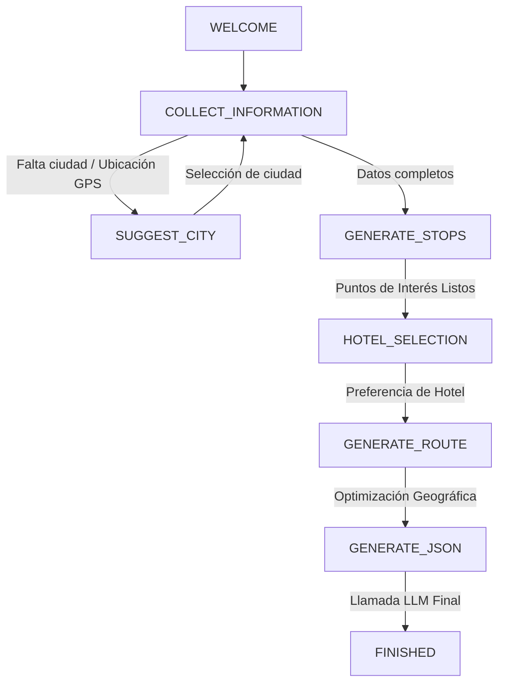

# VibeTours - El Sistema y Motor de Inteligencia Artificial (IA)

## 1. Visión del Motor de IA
En VibeTours, la Inteligencia Artificial no funciona como un chatbot genérico de texto libre. Es un **motor estructurado de planificación y curación turística** que transforma las preferencias de un viajero en un itinerario real, geolocalizado, narrable y optimizado.

El sistema de IA se divide en dos experiencias clave para el usuario:
1.  **AI Planner (Planificador Rápido)**: Un formulario dinámico donde el usuario ingresa su destino, presupuesto, intereses y tipo de viaje. Puede dictar sus preferencias por voz (usando Speech-to-Text). Al procesar, el backend genera instantáneamente un tour con múltiples paradas optimizadas.
2.  **Conversational Travel Assistant (Asistente de Chat)**: Una experiencia conversacional paso a paso que recolecta datos a través del diálogo utilizando una **máquina de estados finita** integrada con modelos de lenguaje.

---

## 2. Máquina de Estados del Asistente de Chat (`chat.js`)
El endpoint `/api/chat/message` procesa los mensajes del usuario evaluando su estado actual para guiarlo a través de un flujo estructurado de recolección de requisitos de viaje:



### Detalle de los Estados:
*   **WELCOME**: Estado inicial al abrir el chat. La IA se presenta y solicita al usuario definir el destino al que desea viajar.
*   **COLLECT_INFORMATION**: Evalúa la entrada del usuario mediante funciones de extracción semántica (OpenAI GPT-4o-mini). Recolecta campos obligatorios: `city` (ciudad), `budget` (presupuesto), `travelers` (compañeros de viaje), `duration` (duración del viaje), `pace` (ritmo de caminata), `schedule` (horarios), `transportation` (medio de transporte) e `interests` (intereses como historia, museos, gastronomía, naturaleza).
*   **SUGGEST_CITY**: Si el usuario envía la ubicación en tiempo real de su dispositivo en lugar de un nombre de ciudad, o si el destino es ambiguo, el backend geocodifica la ubicación y sugiere 3 ciudades cercanas para que el usuario seleccione una.
*   **GENERATE_STOPS**: Una vez definido el destino, el backend consulta las bases de datos geográficas reales de OpenStreetMap para encontrar monumentos, museos y atracciones emblemáticas que estén en un radio máximo de 10 kilómetros.
*   **HOTEL_SELECTION**: La IA ofrece al usuario sugerir un hotel de la base de datos de OpenStreetMap que se acomode a su presupuesto (económico, moderado, lujo) para utilizarlo como punto de partida y de encuentro del tour.
*   **GENERATE_ROUTE**: Recolecta la lista de atracciones seleccionadas y las pasa por el motor de optimización geográfica.
*   **GENERATE_JSON**: Envía todo el contexto (puntos de interés ordenados, perfil de usuario, hotel, presupuesto) al LLM final para que redacte las descripciones turísticas de forma inmersiva y estructure las actividades y curiosidades de cada parada.
*   **FINISHED**: Presenta el tour terminado en la interfaz del chat. El usuario puede pulsar la tarjeta resultante para guardarla directamente en su perfil o iniciar el recorrido en vivo con el GPS.

---

## 3. Integración con Servicios de Datos Reales (Anti-Alucinación)
Para evitar que la IA invente atracciones, museos o direcciones inexistentes (alucinación de los LLMs), el backend de VibeTours implementa una **estrategia de datos geoespaciales reales como ancla**:

1.  **Geocodificación (Nominatim / Photon)**: El backend convierte la entrada del usuario (ej: *"Medellín, Colombia"*) en coordenadas de latitud y longitud exactas. Si la ciudad tiene homónimos (ej: *Cartagena de Indias* vs. *Cartagena de España*), asume automáticamente la correspondiente a la geolocalización actual del usuario para evitar desvíos masivos.
2.  **Consulta de Puntos de Interés (Overpass API)**: A partir de las coordenadas, el backend realiza una petición estructurada a la API de Overpass para extraer puntos de interés físicos reales clasificados como atracciones turísticas, museos, monumentos históricos, miradores, etc.
3.  **Enriquecimiento Cultural (Wikipedia API)**: Para cada punto de interés real obtenido de OpenStreetMap, el backend realiza una búsqueda en Wikipedia para obtener fragmentos de historia, contexto cultural y datos históricos verificables, los cuales se inyectan en el prompt del LLM.
4.  **Optimización de Ruta (TomTom API)**: Los puntos de interés reales no se ordenan al azar. El backend utiliza la API de TomTom para resolver el problema del viajante de comercio (Traveling Salesperson Problem), reordenando las paradas para que el recorrido sea geográficamente coherente y minimice los tiempos de traslado caminando o en transporte.
5.  **Fallback de IA**: Si por problemas de conexión a Overpass no se encuentran suficientes puntos de interés locales en una zona remota, el backend utiliza un prompt de contingencia seguro en OpenAI (`suggestFallbackPlacesWithOpenAI`) para solicitar exclusivamente 3 lugares icónicos que *físicamente existan* en esa coordenada geográfica.

---

## 4. Estructuración y Prompts de los Modelos de Lenguaje
El sistema utiliza dos niveles de prompts altamente detallados para garantizar salidas consistentes:

### A. Extracción Semántica (`extractChatInformation`)
Se encarga de procesar el texto libre del usuario en lenguaje natural y retornar únicamente un objeto JSON con las variables identificadas. Esto permite que el diálogo fluya de manera orgánica sin interrumpir al usuario con formularios de selección rígidos.

### B. Generación de Itinerarios (`planWithOpenAI` / Ollama)
El sistema instruye a los modelos de lenguaje (GPT-4o-mini en la nube u Ollama localmente) mediante directrices sumamente estrictas:
*   **Formato Único**: La respuesta debe ser exclusivamente un JSON válido, sin delimitadores de código markdown (` ```json `), explicaciones previas ni comentarios.
*   **Fidelidad a las Fuentes**: El itinerario debe usar única y exclusivamente la lista de lugares reales (`selectedPlaces`) provista por el backend y respetar el orden optimizado geográficamente.
*   **Calidad Narrativa (Guía de Voz)**:
    *   La descripción general del tour (`descripcion_tour`) debe tener entre 150 y 400 palabras, atrapando al usuario y describiendo la atmósfera del lugar.
    *   Cada descripción de parada (`descripcion`) debe tener de 80 a 150 palabras, escrita con un tono de guía local apasionado.
    *   **Prohibición de Frases Genéricas**: Se prohíbe el uso de frases vacías como *"En esta parada verás..."*, *"Ahora nos dirigimos a..."*, *"Aquí puedes observar..."*. El storytelling debe ser dinámico y directo al grano.
    *   **Acciones Prácticas**: Cada parada debe incluir de forma explícita listas de recomendaciones concisas utilizando guiones (ejemplo: *- Qué hacer en este lugar*, *- Dónde comer cerca*), además de 2 a 5 datos curiosos históricos validados y consejos prácticos sobre qué llevar.

---

## 5. Control de Uso en Modo Invitado (`guestAiRemainingProvider`)
Para evitar el abuso de consumo de las APIs de IA (OpenAI / servidores locales), la aplicación Flutter implementa un contador de uso en el estado del usuario invitado.
*   Los usuarios que no han iniciado sesión en la app tienen un límite inicial de **2 generaciones de tours con IA**.
*   Este control reside en el proveedor de Riverpod `guestAiRemainingProvider`.
*   Cada vez que se genera un tour exitosamente, el contador se reduce en uno. Al llegar a cero, la interfaz bloquea el botón de generación y muestra un cuadro de diálogo sugiriendo al usuario iniciar sesión de forma gratuita para desbloquear generaciones ilimitadas.
